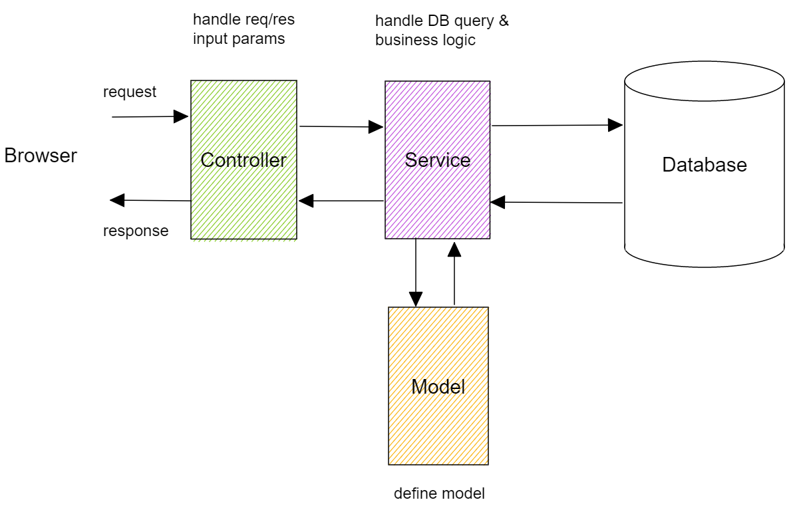
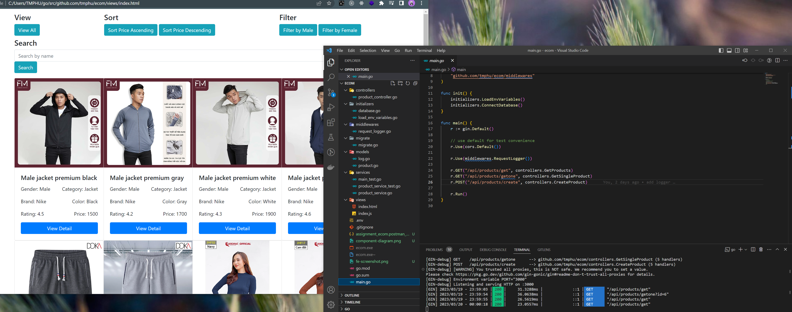

# Introduction
## 1. Solution diagram

## 2. Pattern & Practice

- Implement MVC pattern
- .env file to store environment variables
- middleware to log request

Why MVC?

- Overall, it's a good pattern for small to medium size project. I read many articles, there are other patterns for complex projects like Repository pattern, Dependency Injection, microservices, etc. But I find myself familiar the most with MVC pattern, so I apply it for this assignment.

Unit Test

- I only cover test for 2 functions in ProductService: CreateProduct and GetSingleProduct using Testify. Usually, there are 2 approaches to test API: (1) Connect test DB and run the test against real DB, (2) Mock the web server and DB. I choose first approach for this assignment.
- Go built-in test framework is good enough, but I find Testify make writing test more concise (without if-else statements to compare expected & actual values)

## 3. Folder structure

`/ecom`

- `.env`
- `go.mod`
- `go.sum`
- `main.go`
- `README.md`
- `/controllers`
  - `product_controller.go`
- `/initializers`
  - `database.go`
  - `load_env_variables.go`
- `/middlewares`
  - `request_logger.go`
- `/migrate`
  - `migrate.go`
- `/models`
  - `log.go`
  - `product.go`
- `/services`
  - `main_test.go`
  - `product_service_test.go`
  - `product_service.go`
- `/views`
  - `index.html`
  - `index.js`

## 4. Libraries & Frameworks

- Gin framework
  - Why Gin? I find it one of the most popular Go web framework, easy to set up, fast & lightweight, good documentation & community support.
- GORM
  - Why GORM? Using ORM is a good practice to avoid SQL injection, very fast to develop.
- Testify
  - Why Testify? Go built-in test framework is good enough, but I find Testify make writing test more concise (without if-else statements to compare expected & actual values)
- Dotenv
  - Why Dotenv? Manage environment variables in structural way.
- MySQL
  - Why MySQL? It's a great RDBMS for project of any size.

## 5. How to run
Do the following steps:

- Clone this repository: `git clone https://github.com/tmphu/ecom.git`
- Install dependencies: `go mod download`
- Install MySQL
- Create database name: `db_ecom`
- Update connection string to DB in .env file: `DB_URL`
- Run migration command: `go run migrate/migrate.go` to create tables `products` and `logs` in DB.
- Populate some data: run the SQL INSERT script in `./db_ecom_dump.sql`
- Run the application: `go run main.go`

The web server should be up and running at http://localhost:3000/

- View front-end page, open HTML file: `./views/index.html`
- Alternatively, you can use Postman to test the APIs. Import the Postman collection file: `./assignment_ecom.postman_collection.json`
- Add more products can be done by using CreateProduct API.

_front-end page_
